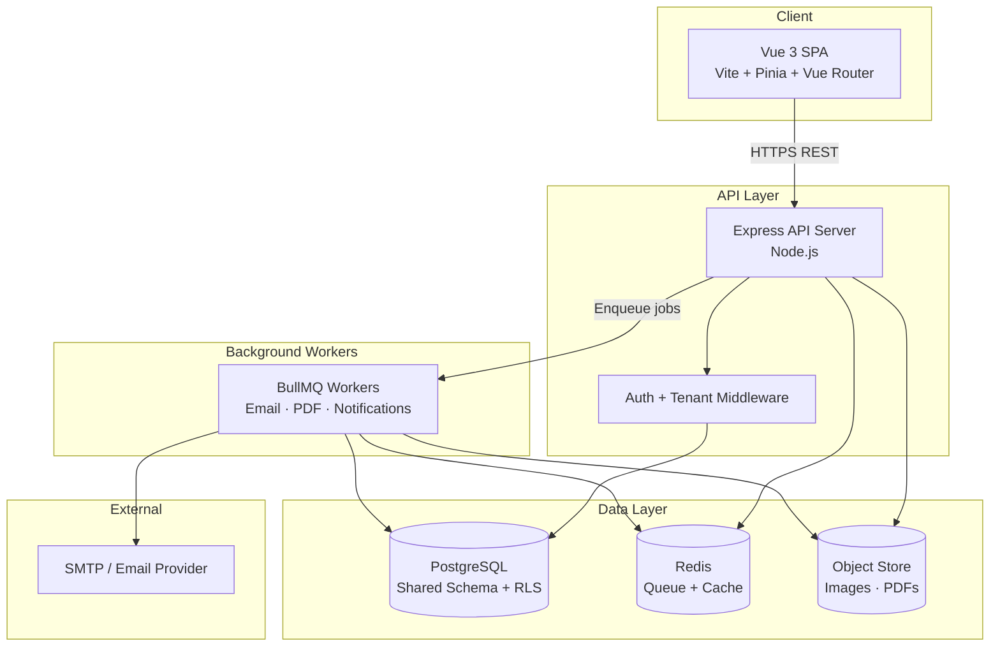
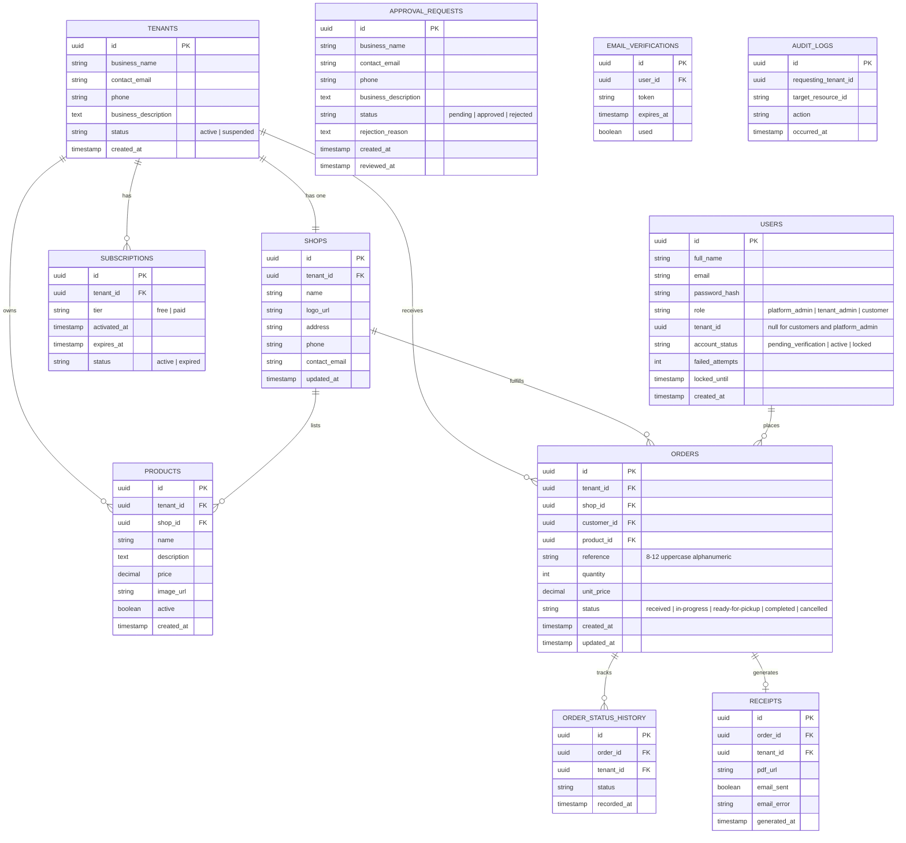

# Design Document

## TAILORSTAQ Multi-Tenant Tailoring Platform

---

## Overview

TAILORSTAQ is a multi-tenant SaaS platform that enables professional tailors and tailoring businesses to operate branded online shops. The platform is built on a Node.js/Express REST API backend and a Vue.js 3 single-page application frontend, backed by PostgreSQL for persistent storage, Redis for caching and job queues, and an object store (e.g., AWS S3 or compatible) for uploaded images.

The architecture follows a shared-database, shared-schema multi-tenancy model where every tenant-scoped table carries a `tenant_id` column. Application-level middleware enforces tenant isolation on every query, supplemented by PostgreSQL Row-Level Security (RLS) policies as a defense-in-depth layer.

**Key design decisions:**

- **Shared schema with `tenant_id` columns** — simpler to operate than per-tenant schemas while still providing strong isolation when combined with RLS.
- **JWT-based stateless authentication** — tokens carry `userId`, `role`, and `tenantId` claims; no server-side session store is required.
- **BullMQ + Redis for async work** — email delivery, PDF generation, and notification dispatch are offloaded to background workers so API responses remain fast.
- **PDFKit for receipt generation** — a pure Node.js library that produces PDF streams without a headless browser, keeping the worker lightweight.
- **Vue 3 Composition API with Pinia** — reactive state management with per-feature stores; Vue Router guards enforce role-based navigation.

---

## Architecture

### High-Level Component Diagram



### Request Lifecycle

1. Vue SPA sends an HTTPS request with a `Bearer <JWT>` header.
2. `authMiddleware` verifies the JWT signature and expiry; attaches `req.user` (`{ userId, role, tenantId }`).
3. `tenantMiddleware` (applied to all tenant-scoped routes) confirms `req.user.tenantId` matches the route's shop/resource owner.
4. Route handler executes business logic, always passing `tenantId` to the data-access layer.
5. Data-access layer appends `WHERE tenant_id = $tenantId` to every query on tenant-scoped tables.
6. Side effects (emails, PDFs) are enqueued as BullMQ jobs; the API responds immediately.
7. BullMQ workers process jobs asynchronously, retrying on failure with exponential back-off.

---

## Components and Interfaces

### Backend Module Structure

```
src/
├── config/           # Environment, DB pool, Redis client
├── middleware/
│   ├── auth.js       # JWT verification, role extraction
│   ├── tenant.js     # Tenant ownership validation
│   └── upload.js     # Multer configuration
├── modules/
│   ├── auth/         # Login, token issuance, lockout
│   ├── tenants/      # Registration, approval, shop setup
│   ├── customers/    # Customer accounts, email verification
│   ├── products/     # Product CRUD
│   ├── orders/       # Order lifecycle
│   ├── subscriptions/# Tier management, limit enforcement
│   ├── receipts/     # PDF generation, download
│   ├── notifications/# Email templates, queue dispatch
│   └── admin/        # Platform_Admin dashboard, metrics
├── queues/
│   ├── email.queue.js
│   ├── pdf.queue.js
│   └── workers/
│       ├── email.worker.js
│       └── pdf.worker.js
├── db/
│   ├── migrations/   # SQL migration files
│   └── queries/      # Per-module query files
└── utils/
    ├── jwt.js
    ├── password.js
    └── orderRef.js
```

### REST API Surface

All endpoints are prefixed with `/api/v1`.

| Method | Path | Role | Description |
|--------|------|------|-------------|
| POST | `/auth/login` | Any | Issue JWT |
| POST | `/auth/register/customer` | Public | Customer registration |
| POST | `/auth/verify-email` | Public | Email verification |
| POST | `/tenants/register` | Public | Tenant approval request |
| GET | `/admin/approvals` | Platform_Admin | List approval requests |
| PATCH | `/admin/approvals/:id` | Platform_Admin | Approve / reject |
| GET | `/admin/tenants` | Platform_Admin | List tenants |
| PATCH | `/admin/tenants/:id/status` | Platform_Admin | Suspend / reactivate |
| GET | `/admin/metrics` | Platform_Admin | Platform metrics |
| GET | `/shops/:shopId` | Tenant_Admin | Get shop details |
| PATCH | `/shops/:shopId` | Tenant_Admin | Update shop settings |
| POST | `/shops/:shopId/logo` | Tenant_Admin | Upload shop logo |
| GET | `/shops/:shopId/products` | Tenant_Admin / Customer | List products |
| POST | `/shops/:shopId/products` | Tenant_Admin | Create product |
| PATCH | `/shops/:shopId/products/:id` | Tenant_Admin | Update product |
| DELETE | `/shops/:shopId/products/:id` | Tenant_Admin | Remove product |
| GET | `/shops/:shopId/orders` | Tenant_Admin | List shop orders |
| PATCH | `/shops/:shopId/orders/:id/status` | Tenant_Admin | Update order status |
| POST | `/shops/:shopId/orders` | Customer | Place order |
| GET | `/customers/me/orders` | Customer | List own orders |
| GET | `/customers/me/orders/:id` | Customer | Order detail + history |
| GET | `/customers/me/orders/:id/receipt` | Customer | Download receipt PDF |
| GET | `/subscriptions/me` | Tenant_Admin | Current subscription |
| POST | `/subscriptions/upgrade` | Tenant_Admin | Initiate upgrade |
| POST | `/subscriptions/confirm` | Tenant_Admin | Confirm payment |

### Frontend Module Structure

```
src/
├── assets/           # Brand colors, fonts, TAILORSTAQ logo
├── components/
│   ├── common/       # LoadingSpinner, ErrorBanner, NavBar, Modal
│   └── brand/        # BrandedHeader, ColorPalette tokens
├── composables/      # useAuth, useTenant, useOrders, useSubscription
├── router/
│   └── index.js      # Route definitions + navigation guards
├── stores/           # Pinia stores per domain
│   ├── auth.store.js
│   ├── shop.store.js
│   ├── orders.store.js
│   └── subscription.store.js
├── views/
│   ├── public/       # Landing, Registration, Login
│   ├── admin/        # Platform_Admin dashboard
│   ├── tenant/       # Shop setup, products, orders, subscription
│   └── customer/     # Order history, profile, receipt download
└── api/              # Axios instance + per-module API clients
```

### Key Interfaces

```javascript
// JWT Payload
{
  sub: string,        // userId
  role: 'platform_admin' | 'tenant_admin' | 'customer',
  tenantId: string | null,  // null for customers and platform_admin
  iat: number,
  exp: number         // max iat + 86400 (24 hours)
}

// Tenant-scoped query helper (data access layer)
async function queryTenant(sql, params, tenantId) {
  // Always appends tenant_id filter; throws if tenantId is missing
}
```

---

## Data Models

### Entity Relationship Diagram



### Multi-Tenancy Enforcement

Every table that holds tenant-scoped data (`shops`, `products`, `orders`, `order_status_history`, `receipts`) carries a `tenant_id UUID NOT NULL` column. PostgreSQL RLS policies are defined as a second line of defense:

```sql
-- Example RLS policy on orders
ALTER TABLE orders ENABLE ROW LEVEL SECURITY;

CREATE POLICY tenant_isolation ON orders
  USING (tenant_id = current_setting('app.current_tenant_id')::uuid);
```

The application sets `app.current_tenant_id` at the start of each transaction via `SET LOCAL`. Application-level middleware also enforces this before any query runs, so the RLS policy acts as a safety net rather than the primary control.

### Subscription Limit Tracking

Free-tier limits are checked at the application layer before write operations:

- **Active products**: `SELECT COUNT(*) FROM products WHERE tenant_id = $1 AND active = true`
- **Monthly orders**: `SELECT COUNT(*) FROM orders WHERE tenant_id = $1 AND created_at >= date_trunc('month', now())`

Both checks run inside the same transaction as the insert to avoid race conditions under concurrent requests.

---

## Correctness Properties

*A property is a characteristic or behavior that should hold true across all valid executions of a system — essentially, a formal statement about what the system should do. Properties serve as the bridge between human-readable specifications and machine-verifiable correctness guarantees.*

### Property 1: Tenant data isolation

*For any* API request made by a Tenant_Admin, the set of resources returned or modified SHALL contain only records whose `tenant_id` matches the authenticated Tenant_Admin's `tenantId` claim.

**Validates: Requirements 7.1, 7.2, 7.5**

---

### Property 2: Cross-tenant access is always denied

*For any* API request where the authenticated Tenant_Admin's `tenantId` does not match the `tenant_id` of the target resource, the platform SHALL return a 403 Forbidden response and SHALL NOT return or modify the target resource.

**Validates: Requirements 7.3, 8.8**

---

### Property 3: Order reference uniqueness

*For any* two distinct Orders created on the platform, their reference numbers SHALL be different.

**Validates: Requirements 5.2**

---

### Property 4: Order status lifecycle validity

*For any* Order, every recorded status transition SHALL follow the defined lifecycle: `received → in-progress → ready-for-pickup → completed`, with `cancelled` reachable from any non-terminal status, and no transition out of `completed` or `cancelled`.

**Validates: Requirements 5.3, 5.7, 5.8**

---

### Property 5: Free-tier limit enforcement

*For any* Tenant on the Free Subscription tier, the platform SHALL reject any operation that would cause the count of active Products to exceed 10 or the count of Orders in the current calendar month to exceed 50.

**Validates: Requirements 3.3, 3.4**

---

### Property 6: Receipt completeness

*For any* completed Order, the generated Receipt SHALL contain the Shop's name, Order reference number, Customer name, Product name, quantity, unit price, line total, Order total, and Order completion date.

**Validates: Requirements 6.2, 6.3**

---

### Property 7: Email verification token expiry

*For any* email verification token, the token SHALL be accepted only if it has not been used and its `expires_at` timestamp is in the future at the time of use.

**Validates: Requirements 4.4**

---

### Property 8: Account lockout after failed attempts

*For any* user account, after 5 consecutive failed login attempts the account SHALL be locked and no further login SHALL succeed until the 15-minute lockout period has elapsed.

**Validates: Requirements 8.5**

---

### Property 9: JWT expiry enforcement

*For any* JWT issued by the platform, a request bearing that token after its `exp` timestamp SHALL be rejected with an authentication error.

**Validates: Requirements 8.3**

---

### Property 10: Image upload validation

*For any* file submitted to a logo or product image upload endpoint, the platform SHALL accept the file if and only if its MIME type is `image/png`, `image/jpeg`, or `image/svg+xml` AND its size is between 1 byte and 5,242,880 bytes (5 MB) inclusive.

**Validates: Requirements 2.3, 2.4, 2.6**

---

### Property 11: Subscription downgrade on payment failure

*For any* Tenant whose Paid Subscription expires or whose payment fails, the Tenant's subscription tier SHALL be set to Free regardless of whether the downgrade notification email is successfully delivered.

**Validates: Requirements 3.8**

---

### Property 12: Order status change persistence regardless of notification

*For any* Order status update, the new status and UTC timestamp SHALL be persisted to the database regardless of whether the Customer notification email is successfully delivered.

**Validates: Requirements 5.4**

---

## Error Handling

### API Error Response Format

All errors follow a consistent JSON envelope:

```json
{
  "error": {
    "code": "VALIDATION_ERROR",
    "message": "Business name must be between 1 and 100 characters.",
    "details": []
  }
}
```

Raw HTTP status codes, stack traces, and internal identifiers are never included in responses sent to clients (Requirement 10.5).

### Error Code Taxonomy

| Code | HTTP Status | Description |
|------|-------------|-------------|
| `VALIDATION_ERROR` | 400 | Input failed field-level validation |
| `DUPLICATE_EMAIL` | 409 | Email already registered |
| `UNAUTHENTICATED` | 401 | Missing or invalid JWT |
| `TOKEN_EXPIRED` | 401 | JWT has expired |
| `FORBIDDEN` | 403 | Authenticated but insufficient permission |
| `CROSS_TENANT_ACCESS` | 403 | Tenant_Admin accessing another tenant's resource |
| `NOT_FOUND` | 404 | Resource does not exist |
| `LIMIT_EXCEEDED` | 422 | Free-tier product or order limit reached |
| `TERMINAL_ORDER_STATE` | 422 | Attempt to update a completed/cancelled order |
| `ACCOUNT_LOCKED` | 423 | Account locked due to failed login attempts |
| `ALREADY_IN_STATE` | 409 | Suspend/reactivate on already-suspended/active account |
| `INTERNAL_ERROR` | 500 | Unexpected server error (logged internally) |

### Notification Failure Handling

Notifications (emails) are dispatched via BullMQ workers. If delivery fails:

- The worker retries up to 3 times with exponential back-off (1 s, 4 s, 16 s).
- After all retries are exhausted, the failure is logged to the `notification_failures` table.
- For receipts specifically, the `receipts.email_sent` flag remains `false` and `receipts.email_error` records the last error message, allowing the Customer to download the PDF directly (Requirement 6.4).
- Business-critical state changes (order status, subscription downgrade, account suspension) are committed to the database before the notification job is enqueued, ensuring the state change is never blocked by email delivery (Requirements 3.8, 5.4, 9.2, 9.3).

### File Upload Errors

Multer is configured with `limits.fileSize = 5 * 1024 * 1024`. The `fileFilter` callback rejects files whose MIME type is not in the allowed set. A zero-byte file is detected by checking `req.file.size === 0` after upload. Each failure path returns a distinct `VALIDATION_ERROR` message identifying the specific failure (Requirement 2.4).

---

## Testing Strategy

### Dual Testing Approach

The platform uses both unit/integration tests and property-based tests for comprehensive coverage.

**Unit and Integration Tests** cover:
- Specific examples and edge cases (e.g., exact boundary values for field lengths)
- Integration points between modules (e.g., order creation triggers subscription limit check)
- Error conditions (e.g., cross-tenant access returns 403 and writes audit log)
- External service interactions via mocks (email delivery, object store)

**Property-Based Tests** cover the universal properties defined in the Correctness Properties section above.

### Property-Based Testing

**Library**: [fast-check](https://github.com/dubzzz/fast-check) (Node.js, actively maintained, excellent TypeScript support)

**Configuration**: Each property test runs a minimum of **100 iterations**.

**Tag format**: `// Feature: tailorstaq-platform, Property N: <property_text>`

**Property test mapping:**

| Property | Test file | Arbitraries |
|----------|-----------|-------------|
| P1 – Tenant data isolation | `tests/pbt/tenant-isolation.test.js` | Random `tenantId` pairs, random resource types |
| P2 – Cross-tenant access denied | `tests/pbt/cross-tenant-access.test.js` | Random tenant pairs where IDs differ |
| P3 – Order reference uniqueness | `tests/pbt/order-reference.test.js` | Batch order creation, check set cardinality |
| P4 – Order status lifecycle | `tests/pbt/order-status-lifecycle.test.js` | Random valid and invalid transition sequences |
| P5 – Free-tier limit enforcement | `tests/pbt/subscription-limits.test.js` | Random product/order counts around boundaries |
| P6 – Receipt completeness | `tests/pbt/receipt-completeness.test.js` | Random completed orders with varying shop data |
| P7 – Email token expiry | `tests/pbt/email-token-expiry.test.js` | Random token ages relative to `expires_at` |
| P8 – Account lockout | `tests/pbt/account-lockout.test.js` | Random sequences of failed/successful attempts |
| P9 – JWT expiry | `tests/pbt/jwt-expiry.test.js` | Random token ages relative to `exp` |
| P10 – Image upload validation | `tests/pbt/image-upload-validation.test.js` | Random MIME types and file sizes |
| P11 – Subscription downgrade | `tests/pbt/subscription-downgrade.test.js` | Simulate payment failure with email delivery failure |
| P12 – Status persistence | `tests/pbt/order-status-persistence.test.js` | Simulate notification failure during status update |

### Unit Test Focus Areas

- Field-level validation (boundary values: min/max lengths, price range, quantity range)
- JWT issuance and claim structure
- Order reference generation (length 8–12, uppercase alphanumeric)
- Receipt PDF structure (field presence, fallback for missing shop data)
- Subscription tier feature entitlement matrix
- Approval request state machine (pending → approved/rejected)

### Integration Test Focus Areas

- Full registration → approval → shop setup → product creation → order placement flow
- Email verification link lifecycle (issue, use, expire, resend)
- Subscription upgrade and downgrade flows
- Platform_Admin suspension and reactivation
- Cross-tenant 403 + audit log write
- Receipt generation and PDF download endpoint

### Frontend Testing

- **Vitest + Vue Test Utils** for component unit tests
- **Playwright** for end-to-end flows (registration, order placement, receipt download)
- Responsive layout tests at 320 px, 768 px, 1280 px, and 1920 px viewports
- Loading indicator presence during async API calls
- Error banner display on API failure (no raw status codes)
